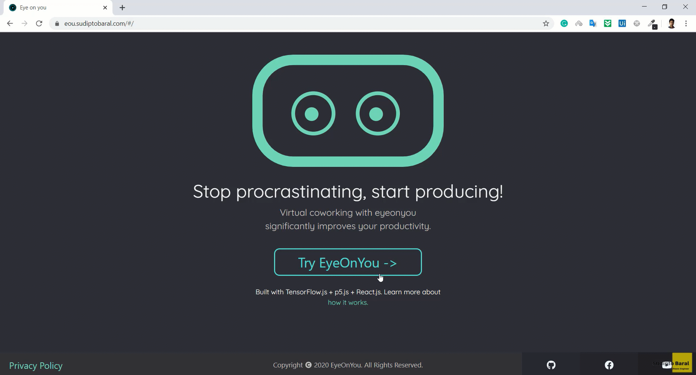

# Eye on You

Stop procrastinating, start producing! Eye on you is Virtual coworking service which significantly improves your productivity. Built with **React**, **P5.js**, **ml5**

## Description

Eye on you is an AI based virtual co-working solution which helps you to focus on your work. EyeOnYou will use Machine Learning to detect your activity such as : movement of your face, hand, eye ect to determine your focus on the computer and notifies you if you loose your focus. As this app do not send any data to the server and the processing is done on the client side so your privacy is protected.

## Video Intro

https://www.youtube.com/watch?v=aIgsaMITHL0

## Installation

-   Clone the repo in your terminal by clicking the _green_ clone or download button at the top right and copyin the url
-   In your terminal, type `git clone URL`
    -   replace URL with the url you copied
    -   hit enter
-   This will copy all the files from this repo down to your computer
-   In your terminal, cd into the directory you just created
-   Type `npm install` to install all dependencies
-   Last, but not least, type `npm start` to run the app locally.

-   To look at the code, just open up the project in your favorite code editor!

## Live Demo

Plese **[visit here](https://eou.sudiptobaral.com/#/)** to see the Live Demo website. Thank you.
